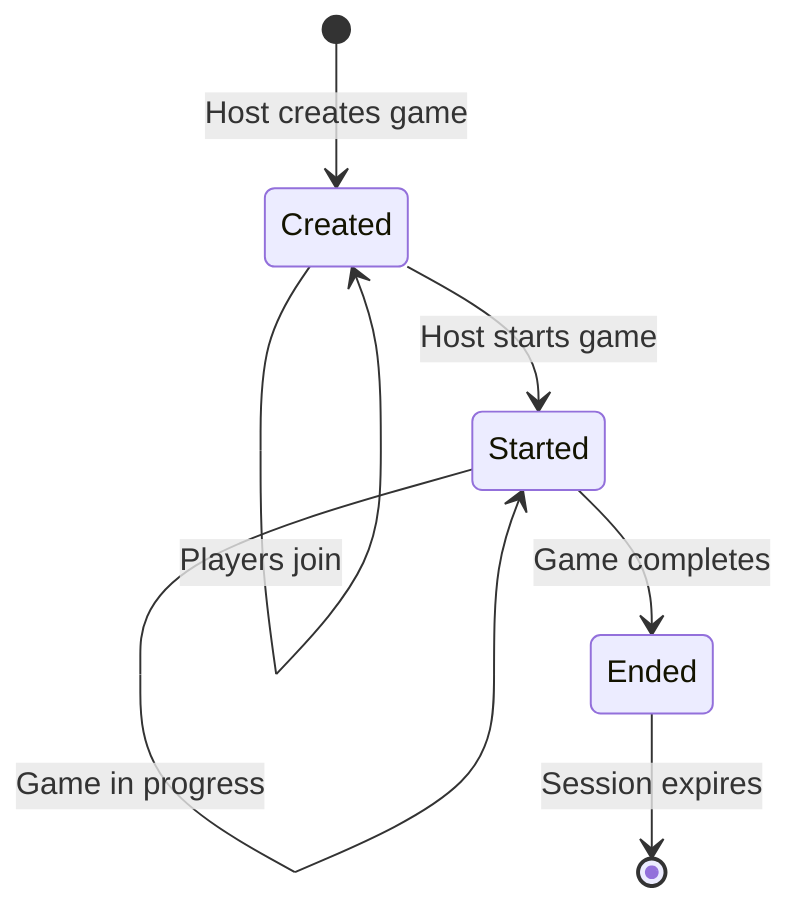

# Data Model: Separate Game Creation and Start States

**Feature**: 002-separate-game-states | **Generated**: 2025-11-09

## Core Entities

### GameSession

Represents a game instance from creation through completion.

```typescript
interface GameSession {
  id: string;                    // Unique session ID (nanoid, 10 chars)
  hostId: string;                // Identifier for the host
  state: GameState;              // Current state of the game
  episodes: Episode[];           // Array of episodes (1-20)
  createdAt: Date;              // Timestamp of creation
  startedAt?: Date;             // Timestamp when game started
  endedAt?: Date;               // Timestamp when game ended
  players: Player[];            // Players who have joined
  maxPlayers: number;           // Maximum players allowed (default: 10)
}

enum GameState {
  CREATED = "created",          // Game created, not yet started
  STARTED = "started",          // Game in progress
  ENDED = "ended"              // Game completed
}
```

### Episode

Content registered by the host during game creation.

```typescript
interface Episode {
  id: string;                   // Unique episode ID (nanoid)
  content: string;              // Episode text content
  order: number;                // Display order (0-based)
  createdAt: Date;             // Timestamp of creation
}
```

### Host

User who creates and manages a game session.

```typescript
interface Host {
  id: string;                   // Host identifier (session-based)
  sessionIds: string[];         // Array of created session IDs
  createdAt: Date;             // First game creation timestamp
}
```

### Player

User who joins a game session.

```typescript
interface Player {
  id: string;                   // Player identifier
  name: string;                // Display name
  joinedAt: Date;              // Timestamp of joining
  isHost: boolean;             // Whether this player is the host
}
```

## Value Objects

### SessionID

```typescript
type SessionID = string;        // 10-character nanoid

// Validation
const isValidSessionID = (id: string): boolean => {
  return /^[A-Za-z0-9_-]{10}$/.test(id);
};
```

### EpisodeContent

```typescript
interface EpisodeContent {
  text: string;                 // 1-500 characters

  // Validation
  validate(): boolean {
    return text.length >= 1 && text.length <= 500;
  }
}
```

## Aggregates

### GameSessionAggregate

Root aggregate for game management.

**Invariants**:
- A game session must have at least 1 episode before starting
- Maximum 20 episodes per game
- Only the host can modify game settings
- Game state transitions: CREATED → STARTED → ENDED (no backwards transitions)
- Session IDs must be globally unique

**Operations**:
- `createSession(hostId: string, episodes: Episode[]): GameSession`
- `addEpisode(episode: Episode): void`
- `removeEpisode(episodeId: string): void`
- `startGame(): void`
- `endGame(): void`
- `addPlayer(player: Player): void`
- `removePlayer(playerId: string): void`

## Repository Interfaces

### IGameSessionRepository

```typescript
interface IGameSessionRepository {
  // Commands
  create(session: GameSession): Promise<void>;
  update(session: GameSession): Promise<void>;
  delete(sessionId: string): Promise<void>;

  // Queries
  findById(sessionId: string): Promise<GameSession | null>;
  findByHostId(hostId: string): Promise<GameSession[]>;
  findActiveGames(): Promise<GameSession[]>;
  exists(sessionId: string): Promise<boolean>;

  // Maintenance
  deleteExpired(before: Date): Promise<number>;
}
```

### IHostRepository

```typescript
interface IHostRepository {
  // Commands
  create(host: Host): Promise<void>;
  addSession(hostId: string, sessionId: string): Promise<void>;

  // Queries
  findById(hostId: string): Promise<Host | null>;
  isHost(hostId: string, sessionId: string): Promise<boolean>;
}
```

## State Transitions



## Data Validation Rules

### Episode Validation
- **Content**: 1-500 characters, non-empty
- **Count**: 1-20 episodes per game
- **Order**: Sequential, starting from 0

### Session Validation
- **ID**: 10 characters, alphanumeric with - and _
- **Host**: Must exist and be valid
- **State**: Must be valid enum value
- **Expiry**: 24 hours after creation

### Player Validation
- **Name**: 1-50 characters
- **Count**: Maximum 10 players per game
- **Uniqueness**: No duplicate player IDs in same game

## Access Control

### Host Permissions
- Create game session ✅
- Add/remove episodes (before start) ✅
- Start game ✅
- End game ✅
- View all game details ✅
- Access Host Management Page ✅

### Player Permissions
- Join game (before/after start) ✅
- View game state ✅
- View episodes (after start) ✅
- Leave game ✅
- Access Host Management Page ❌

## Storage Considerations

### In-Memory Storage (MVP)
- Use Map with session ID as key
- Implement TTL with setTimeout for cleanup
- Store host mappings separately
- Maximum 100 concurrent sessions

### Future Persistence
- Sessions table with indexes on id, hostId, state
- Episodes table with foreign key to sessions
- Players table with composite key (sessionId, playerId)
- Automatic cleanup via scheduled job