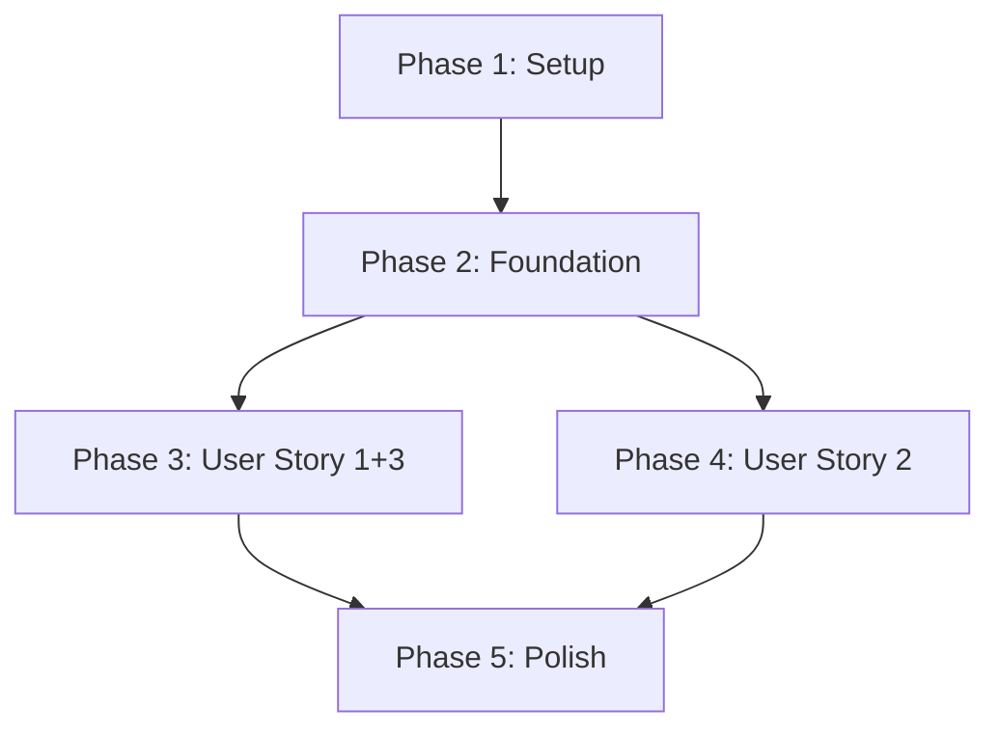

# Implementation Tasks: Separate Game Creation and Start States

**Feature**: 002-separate-game-states | **Generated**: 2025-11-09
**User Stories**: 3 stories (2x P1, 1x P2) | **Total Tasks**: 49

## Implementation Strategy

### MVP Scope (Phase 3 - User Story 1 + User Story 3)
Deliver game creation with state separation first. This provides immediate value:
- Hosts can create games with episodes
- Session IDs are generated and displayed
- Games remain in "created" state (not auto-started)

### Incremental Delivery
- **Phase 3**: Core game creation flow (User Story 1 + 3)
- **Phase 4**: Host management access (User Story 2)
- **Phase 5**: Polish and edge cases

### Parallel Execution Opportunities
- Within each phase, [P] marked tasks can run in parallel
- Different developers can work on backend vs frontend tasks
- Test files can be written in parallel with implementations

## Phase 1: Setup & Infrastructure

Set up the foundational structure and configurations needed for the feature.

- [x] T001 Create base type definitions in src/types/session.ts
- [x] T002 Create episode type definitions in src/types/episode.ts
- [x] T003 Set up Toast context provider in src/contexts/ToastContext.tsx
- [x] T004 Create Toast UI component in src/components/ui/Toast/Toast.tsx
- [x] T005 [P] Configure Toast provider in app layout at src/app/layout.tsx

## Phase 2: Foundational Components

Build shared components and utilities that multiple user stories depend on.

- [x] T006 Create useToast hook in src/hooks/useToast.ts
- [x] T007 Create session ID generator utility in src/lib/sessionId.ts
- [x] T008 Create API response type utilities in src/lib/api-response.ts
- [x] T009 [P] Create host cookie utilities in src/lib/cookies.ts

## Phase 3: User Story 1 + 3 - Game Creation with State Separation [P1]

**Goal**: Enable hosts to create games with episodes, receive session ID confirmation, and maintain created state.

**Independent Test**: Create a game with episodes → See toast with session ID → Redirect to /join → Verify game is in "created" state

### Backend Implementation (Clean Architecture)

- [x] T010 [US1] Write tests for GameSession entity in tests/unit/domain/entities/GameSession.test.ts
- [x] T011 [US1] Implement GameSession entity in src/server/domain/entities/GameSession.ts
- [x] T012 [P] [US1] Write tests for Episode entity in tests/unit/domain/entities/Episode.test.ts
- [x] T013 [P] [US1] Implement Episode entity in src/server/domain/entities/Episode.ts
- [x] T014 [US1] Write tests for IGameSessionRepository interface in tests/unit/domain/repositories/IGameSessionRepository.test.ts
- [x] T015 [US1] Define IGameSessionRepository interface in src/server/domain/repositories/IGameSessionRepository.ts
- [x] T016 [US1] Write tests for InMemoryGameSessionRepository in tests/unit/infrastructure/repositories/InMemoryGameSessionRepository.test.ts
- [x] T017 [US1] Implement InMemoryGameSessionRepository in src/server/infrastructure/repositories/InMemoryGameSessionRepository.ts
- [x] T018 [US1] Write tests for CreateGameSessionUseCase in tests/unit/application/use-cases/CreateGameSessionUseCase.test.ts
- [x] T019 [US1] Implement CreateGameSessionUseCase in src/server/application/use-cases/sessions/CreateGameSessionUseCase.ts
- [x] T020 [US1] Write API integration tests for POST /api/sessions in tests/integration/api/sessions.test.ts
- [x] T021 [US1] Implement POST /api/sessions route in src/app/api/sessions/route.ts

### Frontend Implementation

- [x] T022 [US1] Write tests for useGameCreation hook in tests/unit/hooks/useGameCreation.test.ts
- [x] T023 [US1] Implement useGameCreation hook in src/hooks/useGameCreation.ts
- [x] T024 [P] [US1] Write tests for EpisodeForm component in tests/component/domain/game/EpisodeForm.test.tsx
- [x] T025 [P] [US1] Implement EpisodeForm component in src/components/domain/game/EpisodeForm/EpisodeForm.tsx
- [x] T026 [US1] Write tests for CreatePage component in tests/component/pages/CreatePage.test.tsx
- [x] T027 [US1] Implement CreatePage component in src/components/pages/CreatePage/CreatePage.tsx
- [x] T028 [US1] Create game creation page route in src/app/(pages)/create/page.tsx
- [x] T029 [P] [US1] Write tests for JoinPage redirect behavior in tests/component/pages/JoinPage.test.tsx
- [x] T030 [P] [US1] Update JoinPage component for redirect in src/components/pages/JoinPage/JoinPage.tsx
- [x] T031 [US1] Update Join page route in src/app/(pages)/join/page.tsx

## Phase 4: User Story 2 - Host Management Access [P2]

**Goal**: Allow hosts to access management page from Join Page.

**Independent Test**: As host on /join → See Host Management link → Click link → Navigate to /host/[sessionId]

### Backend Implementation

- [x] T032 [US2] Write tests for CheckHostAccessUseCase in tests/unit/application/use-cases/CheckHostAccessUseCase.test.ts
- [x] T033 [US2] Implement CheckHostAccessUseCase in src/server/application/use-cases/sessions/CheckHostAccessUseCase.ts
- [x] T034 [US2] Write API tests for GET /api/sessions/[sessionId]/host-access in tests/integration/api/sessions-host-access.test.ts
- [x] T035 [US2] Implement GET /api/sessions/[sessionId]/host-access in src/app/api/sessions/[sessionId]/host-access/route.ts

### Frontend Implementation

- [x] T036 [US2] Write tests for useHostAccess hook in tests/unit/hooks/useHostAccess.test.ts
- [x] T037 [US2] Implement useHostAccess hook in src/hooks/useHostAccess.ts
- [x] T038 [P] [US2] Write tests for HostLink component in tests/component/domain/host/HostLink.test.tsx
- [x] T039 [P] [US2] Implement HostLink component in src/components/domain/host/HostLink/HostLink.tsx
- [x] T040 [US2] Write tests for HostManagementPage component in tests/component/pages/HostManagementPage.test.tsx
- [x] T041 [US2] Implement HostManagementPage component in src/components/pages/HostManagementPage/HostManagementPage.tsx
- [x] T042 [US2] Create host management page route in src/app/(pages)/host/[sessionId]/page.tsx
- [x] T043 [US2] Integrate HostLink into JoinPage in src/components/pages/JoinPage/JoinPage.tsx

## Phase 5: Polish & Edge Cases

Handle edge cases and improve user experience.

- [x] T044 Add episode validation (1-20 limit, non-empty) in src/components/domain/game/EpisodeForm/EpisodeForm.tsx
- [x] T045 [P] Add network error handling in useGameCreation hook in src/hooks/useGameCreation.ts
- [x] T046 [P] Add session expiry cleanup timer in src/server/infrastructure/repositories/InMemoryGameSessionRepository.ts
- [x] T047 Add loading states to all async operations
- [x] T048 Add proper error boundaries and fallbacks
- [x] T049 Verify mobile responsiveness for all new pages

## Dependencies Graph

## Parallel Execution Examples

### Phase 3 Parallel Groups
**Group A (Backend Domain)**:
- T010-T015: Entity tests and implementations

**Group B (Backend Infrastructure)**:
- T016-T017: Repository implementation

**Group C (Frontend Components)**:
- T024-T025: EpisodeForm component
- T029-T030: JoinPage updates

### Phase 4 Parallel Groups
**Group A (Backend)**:
- T032-T035: Host access API

**Group B (Frontend)**:
- T038-T039: HostLink component
- T040-T041: HostManagementPage

## Validation Checklist

- ✅ All tasks follow format: `- [ ] T### [P?] [Story?] Description with file path`
- ✅ Each user story phase is independently testable
- ✅ TDD approach: Test tasks before implementation tasks
- ✅ Clean Architecture: Proper layer separation
- ✅ Component Architecture: Three-layer hierarchy maintained
- ✅ Custom Hooks: All logic in hooks, not components
- ✅ Total tasks: 49
- ✅ User Story 1+3 tasks: 22
- ✅ User Story 2 tasks: 12
- ✅ Parallel opportunities: 15 tasks marked [P]

## Notes

- Session IDs use nanoid (already in dependencies)
- Toast notifications have 5-second minimum display
- Host identification via cookies for MVP
- In-memory storage with 24-hour TTL
- All components follow Server Components First principle where applicable